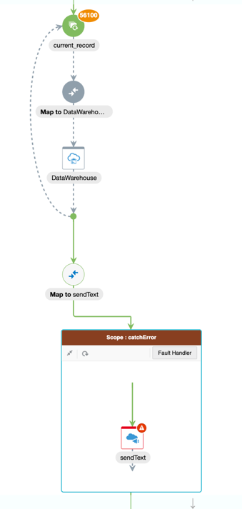
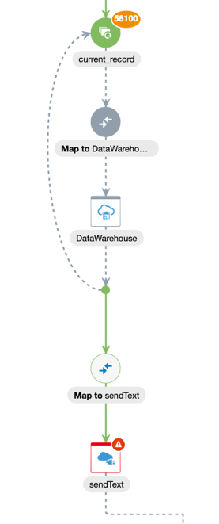
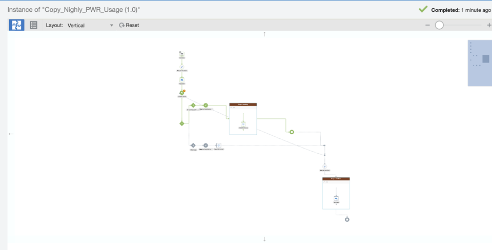
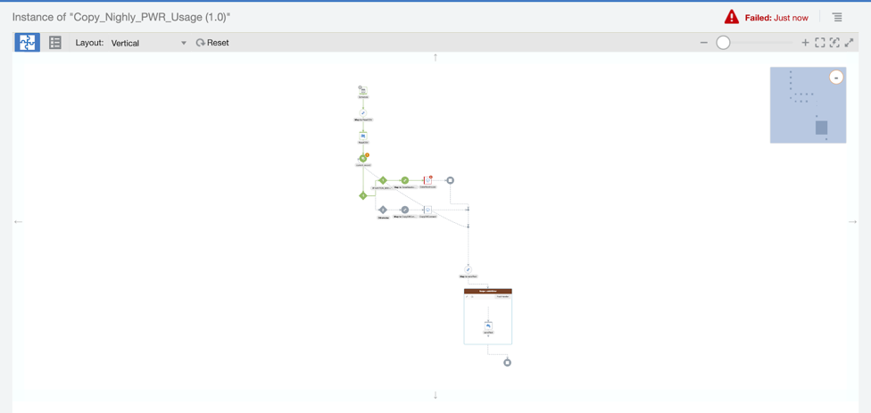
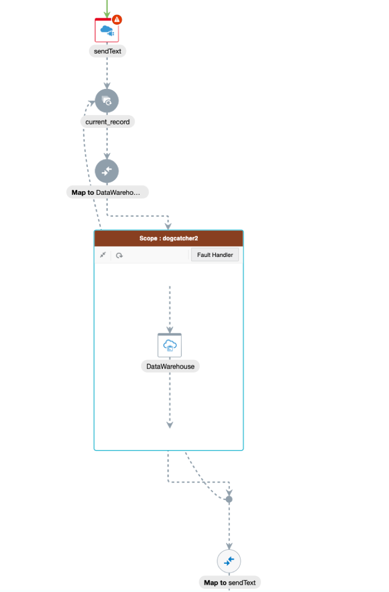
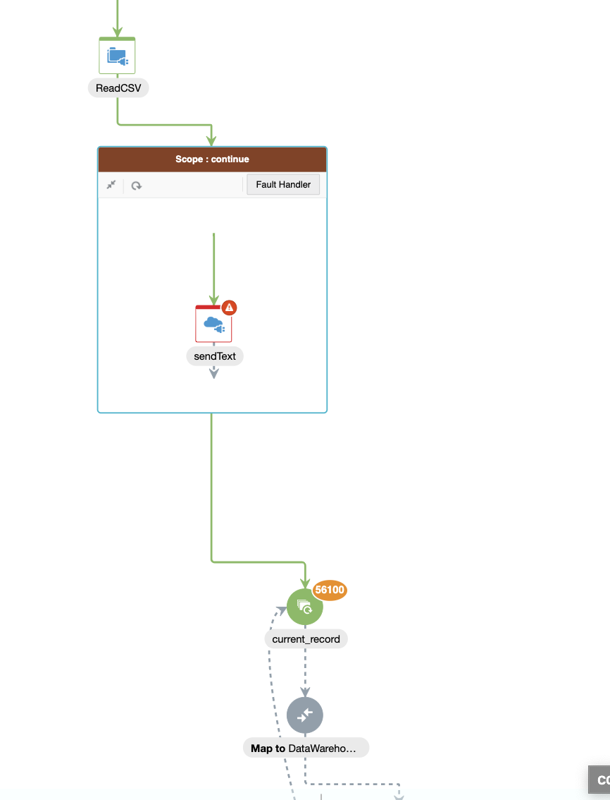
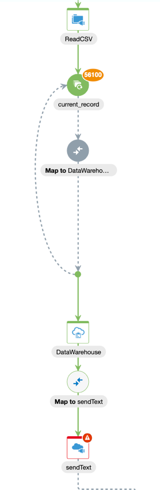

# Summary on how errors, parallelism, synchronicity & error handling works in OIC

Situation of concern, how to handle a file upload if a row is messed up or something else in a integration fails? The one outlined below is a scheduled orchestration that was triggered manually for the following tests.

### Different scenarios examined:
	Error in csv, stopping with switch statement
	Scope handlers around the error prone, database & 3rd party call*
	What if the API call comes first?

*3rd party call meaning an API call to a system other than the FTP server or database receiving csv upload.

## Scenario 1, with an error catch on the API call

Parallel: no
Time taken: 26 min 37 sec
Result: database filled with all rows, marked as completed
Could watch DB rows fill up live

Parallel: yes
Time taken: 16 min, 8 sec
Result: all rows inserted, marked as completed due to scope around serverless function
Watched it fill up live, something like ~300 in 5 secs

## Scenario 2, The above, but without a scope on the API call

Parallel: yes
Time taken: 12 min 46 sec
Resulted: Rows are still uploaded to database, appears as failed in OIC though (result of no scope)
Watched it fill up live

## Scenario 3, switch statement ending integration

The middle of the CSV has a row with the word ‘dog’ in it. The switch statement routes this condition to stop the integration.

In this case, nothing was uploaded to the database due to the stop condition being triggered on that branch of the integration.

In this case where an error is triggered, nothing was uploaded to the integration due to the error within the switch statement, the stop condition was not triggered. Though using fault handling would get past this issue, the integration would hit the stop condition and end. 

## Scenario 4, what if the error’d API call comes first?

error stops integration, nothing to database

## Scenario 5, what if the API call is error handled?

In this case, the integration was completed; I could watch the database fill up live, and all the stayed there. This is because the error'd API call was surrounded by a scope action.

## Bonus scenario, database adapter anti-pattern

When DB adapter not in for each loop, like below, you will not watch it fill up live, monitoring marks it as failure, and NO row is added to database (56100), scope around the database adapter will not alter this, database adapter must be inside the for each loop

